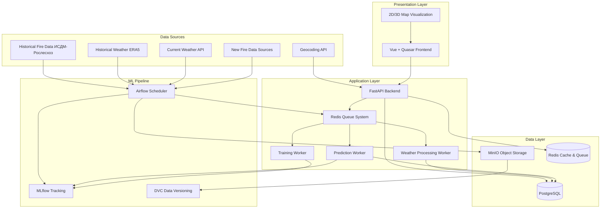

# Дизайн системы предсказания лесных пожаров

## Обзор

Система представляет собой MLOps платформу, состоящую из нескольких взаимосвязанных компонентов:
- **Data Pipeline** (Airflow) - автоматизация работы с данными
- **ML Pipeline** (MLflow + DVC) - управление моделями и экспериментами  
- **Prediction API** (FastAPI) - сервис предсказаний
- **Web Interface** (Vue + Quasar) - пользовательский интерфейс
- **Storage Layer** (PostgreSQL + MinIO + Redis) - хранение данных

## Архитектура

### Высокоуровневая архитектура



### Слоистая архитектура

#### 1. Data Layer (Слой данных)
- **PostgreSQL**: Метаданные, пользователи, прогнозы, история
- **MinIO**: Исторические данные, модели ML, артефакты
- **Redis**: Кэширование прогнозов, сессии пользователей

#### 2. ML Pipeline Layer (Слой машинного обучения)
- **Airflow**: Оркестрация ETL процессов и переобучения моделей
- **MLflow**: Трекинг экспериментов, управление моделями
- **DVC**: Версионирование данных и моделей

#### 3. Business Logic Layer (Слой бизнес-логики)
- **Prediction Service**: Генерация прогнозов по запросу
- **Data Processing Service**: Обработка и валидация данных
- **Model Management Service**: Управление жизненным циклом моделей

#### 4. API Layer (Слой API)
- **Authentication Service**: JWT аутентификация
- **Prediction API**: Endpoints для получения прогнозов
- **Admin API**: Управление пользователями и системой

#### 5. Presentation Layer (Слой представления)
- **Web Application**: Vue.js + Quasar интерфейс
- **Map Visualization**: 3D карта с визуализацией рисков

## Компоненты и интерфейсы

### 1. Airflow Data Pipeline

#### Компоненты:
- **Historical Data Loader**: Загрузка CSV и NetCDF файлов
- **Weather Data Collector**: Получение актуальных метеоданных
- **Data Preprocessor**: Создание сетки координат 0.5°, временные признаки
- **Feature Engineer**: Объединение пожаров с метеоданными
- **Model Trainer**: LightGBM с Optuna оптимизацией
- **Batch Predictor**: Генерация прогнозов для всех точек

#### DAG структура:
```python
# Первичная загрузка исторических данных (выполняется один раз)
initial_data_load_dag = DAG(
    'initial_historical_data_load',
    schedule_interval=None,  # Запускается вручную
    tasks=[
        load_historical_fires_csv,      # russia_fires_hist.csv
        load_historical_weather_nc,     # ERA5 NetCDF файлы
        create_training_dataset,        # Объединение данных
        store_in_dvc                    # Версионирование через DVC
    ]
)

# Ежедневный pipeline
daily_prediction_dag = DAG(
    'daily_prediction_pipeline',
    schedule_interval='0 6 * * *',  # Каждый день в 6:00
    tasks=[
        fetch_current_weather,          # Актуальная погода
        generate_batch_predictions,     # Прогнозы для всех точек
        store_predictions_db,           # Сохранение в PostgreSQL
        cleanup_old_predictions
    ]
)

# Еженедельное переобучение
model_training_dag = DAG(
    'weekly_model_training',
    schedule_interval='0 2 * * 0',  # Каждое воскресенье в 2:00
    tasks=[
        fetch_new_fire_data,           # Получение новых данных о пожарах
        update_historical_dataset,     # Обновление исторического датасета
        prepare_training_data,         # Подготовка данных из DVC
        train_lightgbm_model,         # Обучение LightGBM (как в notebook)
        evaluate_model_performance,    # Оценка качества
        register_model_mlflow,        # Регистрация в MLflow
        deploy_if_better              # Деплой если модель лучше
    ]
)
```

### 2. FastAPI Backend + Worker System

#### Модули:
```
backend/app/modules/
├── auth/           # Аутентификация и авторизация
├── predictions/    # Сервис прогнозов
├── data/          # Управление данными
├── maps/          # Геопространственные данные
├── analytics/     # Аналитика и отчеты
├── workers/       # Система воркеров и очередей
└── admin/         # Административные функции
```

#### Система очередей (Redis Queue)
```python
# Типы задач для воркеров
class TaskType(Enum):
    WEATHER_DATA_PROCESSING = "weather_processing"
    BATCH_PREDICTION = "batch_prediction"
    MODEL_TRAINING = "model_training"
    DATA_VALIDATION = "data_validation"

# Воркеры для асинхронной обработки
class WeatherProcessingWorker:
    """Воркер для обработки метеоданных"""
    
    @staticmethod
    def process_weather_data(weather_data: dict):
        # Валидация и обработка метеоданных
        # Сохранение в БД
        pass

class PredictionWorker:
    """Воркер для генерации предсказаний"""
    
    @staticmethod
    def generate_predictions(coordinates: List[tuple], date: str):
        # Загрузка модели из MLflow
        # Генерация предсказаний
        # Сохранение результатов
        pass

class ModelTrainingWorker:
    """Воркер для обучения моделей"""
    
    @staticmethod
    def train_model(training_config: dict):
        # Подготовка данных
        # Обучение модели
        # Регистрация в MLflow
        pass

# Celery конфигурация (воркеры + Redis как брокер)
from celery import Celery

celery_app = Celery(
    'wildfire_prediction',
    broker='redis://localhost:6379/0',
    backend='redis://localhost:6379/0'
)

# Celery воркеры
@celery_app.task
def process_weather_data(weather_data: dict):
    # Обработка метеоданных
    pass

@celery_app.task
def generate_prediction(coordinates: tuple, date: str):
    # Генерация предсказания (загружает модель через DVC)
    pass

@celery_app.task
def train_model(training_config: dict):
    # Обучение модели
    pass

# Преимущества Celery:
# - Автоматическое управление задачами и retry
# - Мониторинг через Flower
# - Масштабирование воркеров
# - Redis как брокер очередей

# Правильная архитектура выполнения:
# 1. FastAPI получает запрос на предсказание
# 2. FastAPI отправляет задачу в Redis Queue через Celery.send_task()
# 3. Celery воркер забирает задачу из Redis Queue
# 4. Воркер загружает модель через DVC
# 5. Воркер выполняет предсказание
# 6. Результат сохраняется в PostgreSQL
# 7. Статус задачи обновляется в Redis (Celery backend)
```

#### API Architecture - детальная разбивка

### 1. Основные endpoints (базовая функциональность)
```python
# Health Check
GET  /health                               # Статус системы
GET  /api/v1/health/detailed              # Детальный статус (БД, Redis, воркеры)

# Аутентификация (базовая)
POST /api/v1/auth/login                   # Логин пользователя
POST /api/v1/auth/logout                  # Логаут
GET  /api/v1/auth/me                      # Текущий пользователь
```

### 2. Backend API для воркеров (минимальный набор)
```python
# Воркеры работают напрямую с БД и DVC, API не нужно
# Celery управляет задачами и статусами
# DVC управляет моделями

# Только для критического логирования (опционально)
POST /internal/v1/logs/critical          # Критические ошибки системы
```

### 3. Frontend API (для пользовательского интерфейса)
```python
# Основные прогнозы
POST /api/v1/predictions/request          # Запрос прогноза (возвращает task_id)
  # Body: {"latitude": 55.7558, "longitude": 37.6176}
  # Response: {"task_id": "uuid", "status": "queued", "estimated_time": 30}

GET  /api/v1/predictions/status/{task_id} # Статус задачи
  # Response: {"status": "completed", "result": {...}, "progress": 100}

POST /api/v1/predictions/by-location      # Прогноз по названию места
  # Body: {"location": "Москва", "region": "Московская область"}
  # Response: {"task_id": "uuid", "coordinates": [55.7558, 37.6176]}

# Карты и визуализация
GET  /api/v1/maps/risk-grid/{date}         # Сетка рисков для карты
  # Response: [{"lat": 55.0, "lon": 37.0, "risk": 0.8, "confidence": 0.9}]

GET  /api/v1/maps/regions                  # Список регионов России
  # Response: [{"name": "Московская область", "bounds": {...}}]

GET  /api/v1/maps/historical-fires        # Исторические пожары для карты
  # Query: ?start_date=2023-01-01&end_date=2023-12-31&region=moscow
  # Response: [{"date": "2023-06-15", "lat": 55.1, "lon": 37.2}]

# Пользовательские данные
GET  /api/v1/user/predictions/history      # История запросов пользователя
POST /api/v1/user/locations/favorite      # Добавить в избранное
GET  /api/v1/user/locations/favorite      # Избранные места

# Аналитика (для дашборда)
GET  /api/v1/analytics/summary             # Общая статистика
  # Response: {"total_predictions": 1000, "accuracy": 0.85, "avg_risk": 0.3}

GET  /api/v1/analytics/trends              # Тренды по времени
  # Query: ?period=month&region=all
  # Response: [{"date": "2023-06", "fire_count": 45, "avg_risk": 0.4}]

GET  /api/v1/analytics/regions             # Статистика по регионам
  # Response: [{"region": "Сибирь", "fire_count": 120, "avg_risk": 0.6}]

# Автокомплит и поиск
GET  /api/v1/search/locations              # Поиск мест
  # Query: ?q=Моск&limit=10
  # Response: [{"name": "Москва", "region": "Московская область", "coords": [...]}]

GET  /api/v1/search/suggestions            # Популярные места
  # Response: [{"name": "Москва", "usage_count": 500}]
```

### 4. Admin API (базовое администрирование)
```python
# Мониторинг системы
GET  /api/v1/admin/system/status          # Статус API, БД, Celery
GET  /api/v1/admin/celery/stats            # Статистика Celery воркеров

# Управление пользователями (базовое)
GET  /api/v1/admin/users                  # Список пользователей
POST /api/v1/admin/users/{id}/block       # Блокировка пользователя

# DVC и модели управляются через CLI, не через API
```

#### Примеры запросов и ответов

### Основной flow для фронтенда:

#### 1. Запрос прогноза
```python
# POST /api/v1/predictions/request
{
  "latitude": 55.7558,
  "longitude": 37.6176,
  "date": "2024-07-15"  # опционально, по умолчанию завтра
}

# Response:
{
  "success": true,
  "data": {
    "task_id": "pred_123e4567-e89b-12d3-a456-426614174000",
    "status": "PENDING",  # Celery статус: PENDING, STARTED, SUCCESS, FAILURE
    "estimated_time_seconds": 30
  },
  "message": "Prediction task sent to Redis queue"
}
```

#### 2. Проверка статуса
```python
# GET /api/v1/predictions/status/pred_123e4567-e89b-12d3-a456-426614174000

# Response (в процессе):
{
  "success": true,
  "data": {
    "task_id": "pred_123e4567-e89b-12d3-a456-426614174000",
    "status": "STARTED",  # Celery воркер забрал задачу из Redis Queue
    "current_step": "Loading model from DVC"
  }
}

# Response (завершено):
{
  "success": true,
  "data": {
    "task_id": "pred_123e4567-e89b-12d3-a456-426614174000",
    "status": "SUCCESS",  # Celery воркер завершил задачу
    "result": {
      "latitude": 55.7558,
      "longitude": 37.6176,
      "prediction_date": "2024-07-15",
      "fire_risk": 0.75,
      "confidence": 0.89,
      "risk_level": "HIGH",
      "weather_conditions": {
        "temperature": 28.5,
        "humidity": 35,
        "wind_speed": 12.3,
        "precipitation": 0.0
      },
      "contributing_factors": [
        "High temperature",
        "Low humidity", 
        "Strong wind"
      ]
    }
  }
}
```

#### 3. Данные для карты
```python
# GET /api/v1/maps/risk-grid/2024-07-15?bounds=55.0,37.0,56.0,38.0

# Response:
{
  "success": true,
  "data": {
    "date": "2024-07-15",
    "grid_size": 0.5,
    "points": [
      {
        "latitude": 55.0,
        "longitude": 37.0,
        "fire_risk": 0.3,
        "confidence": 0.85,
        "risk_level": "LOW"
      },
      {
        "latitude": 55.0,
        "longitude": 37.5,
        "fire_risk": 0.8,
        "confidence": 0.92,
        "risk_level": "HIGH"
      }
    ],
    "total_points": 2,
    "model_version": "v1.2.3"
  }
}
```

#### Запуск Celery воркеров:
```bash
# Запуск Celery воркеров
celery -A app.celery_app worker --loglevel=info --concurrency=4

# Запуск воркеров для конкретных задач
celery -A app.celery_app worker --loglevel=info --queues=weather_processing
celery -A app.celery_app worker --loglevel=info --queues=predictions
celery -A app.celery_app worker --loglevel=info --queues=model_training

# Мониторинг через Flower
celery -A app.celery_app flower

# Production через supervisor
supervisorctl start celery_worker
supervisorctl start celery_flower
```

### 3. Vue + Quasar Frontend

#### Модули:
```
frontend/src/modules/
├── auth/          # Логин, регистрация
├── dashboard/     # Главная панель
├── maps/          # 3D карта и визуализация
├── predictions/   # Запрос прогнозов
├── analytics/     # Аналитические отчеты
└── admin/         # Административная панель
```

## Визуализация карт - варианты реализации

### Вариант 1: 2D карта с высоким качеством (Рекомендуемый для MVP)
**Технологии**: Leaflet + OpenStreetMap + GeoJSON
**Преимущества**:
- Быстрая разработка и отладка
- Отличная производительность
- Простая интеграция с данными
- Хорошая поддержка мобильных устройств

**Реализация**:
```javascript
// Leaflet с тепловой картой рисков
const map = L.map('map').setView([55.7558, 37.6176], 5);
const heatLayer = L.heatLayer(riskPoints, {
  radius: 25,
  blur: 15,
  maxZoom: 17,
  gradient: {
    0.0: 'green',
    0.5: 'yellow', 
    0.8: 'orange',
    1.0: 'red'
  }
});
```

### Вариант 2: 3D карта планеты (Для будущих версий)
**Технологии**: Three.js + Cesium.js или Deck.gl
**Преимущества**:
- Впечатляющая визуализация
- Возможность показать рельеф и высоты
- Эффектная презентация данных

**Сложности**:
- Высокая сложность разработки
- Требует больше ресурсов браузера
- Сложнее оптимизировать для мобильных устройств

**Поэтапная реализация**:
1. **MVP**: 2D карта с тепловой картой рисков
2. **V2**: Добавление 3D элементов (высота риска)
3. **V3**: Полная 3D карта планеты

## Источники новых данных о пожарах

### Для переобучения модели необходимы актуальные данные:

#### 1. Официальные источники РФ:
- **ИСДМ-Рослесхоз**: Обновленные данные (если доступны через API)
- **МЧС России**: Сводки о чрезвычайных ситуациях
- **Авиалесоохрана**: Данные авиационного мониторинга

#### 2. Спутниковые данные:
- **MODIS Fire Detection**: NASA спутниковые данные
- **VIIRS Active Fire**: NOAA/NASA активные пожары
- **Sentinel-2**: ESA спутниковые снимки
- **Landsat**: USGS спутниковые данные

#### 3. Открытые источники:
- **Global Forest Watch**: Мониторинг лесов
- **FIRMS (Fire Information)**: NASA система пожарной информации
- **Copernicus Emergency**: Европейская система мониторинга

#### 4. Реализация в Airflow:
```python
def fetch_new_fire_data():
    """Получение новых данных о пожарах из различных источников"""
    
    # MODIS/VIIRS данные
    modis_data = fetch_modis_fire_data(
        start_date=last_update_date,
        end_date=datetime.now(),
        region='russia'
    )
    
    # Фильтрация по России
    russia_fires = filter_by_coordinates(
        modis_data, 
        lat_range=(41.2, 81.9),  # Широта России
        lon_range=(19.6, 169.0)  # Долгота России
    )
    
    # Стандартизация формата
    standardized_data = standardize_fire_data(russia_fires)
    
    return standardized_data
```

### Рекомендуемый подход для карт:

#### Этап 1 (MVP): 2D карта
```javascript
// Quasar + Leaflet компонент
<template>
  <div class="map-container">
    <l-map
      :zoom="zoom"
      :center="center"
      @ready="onMapReady"
    >
      <l-tile-layer :url="tileUrl" />
      <l-heat-layer 
        :lat-lng="heatData"
        :options="heatOptions"
      />
      <l-marker
        v-for="point in riskPoints"
        :key="point.id"
        :lat-lng="point.coordinates"
        @click="showPredictionDetails(point)"
      />
    </l-map>
  </div>
</template>
```

#### Этап 2: Добавление 3D элементов
```javascript
// Интеграция с Deck.gl для 3D визуализации
const deckLayer = new HexagonLayer({
  id: 'fire-risk-hexagon',
  data: riskData,
  getPosition: d => [d.longitude, d.latitude],
  getElevationWeight: d => d.risk_level,
  elevationScale: 1000,
  radius: 5000
});
```

## Структура базы данных и ORM

### Архитектура SQLAlchemy

#### Структура файлов:
```
backend/app/
├── core/
│   ├── database.py          # Engine, SessionLocal, Base, get_db()
│   ├── config.py            # DATABASE_URL, настройки
│   └── dependencies.py      # FastAPI dependencies
├── models/
│   ├── __init__.py          # from .fire import *, from .weather import *
│   ├── base.py              # BaseModel с id, created_at, updated_at
│   ├── fire.py              # HistoricalFire, ProcessedFireData
│   ├── weather.py           # WeatherData, ProcessedWeatherData
│   ├── prediction.py        # FirePrediction, BatchPrediction
│   ├── user.py              # User, UserSession
│   └── monitoring.py        # SystemHealth, ErrorLog
├── repositories/
│   ├── base.py              # BaseRepository[T] с CRUD операциями
│   ├── fire.py              # FireRepository
│   ├── weather.py           # WeatherRepository
│   └── prediction.py        # PredictionRepository
```

#### core/database.py:
```python
from sqlalchemy import create_engine
from sqlalchemy.ext.declarative import declarative_base
from sqlalchemy.orm import sessionmaker, Session
from .config import settings

# SQLAlchemy setup
engine = create_engine(
    settings.DATABASE_URL,
    pool_pre_ping=True,
    echo=settings.DEBUG
)

SessionLocal = sessionmaker(
    autocommit=False,
    autoflush=False,
    bind=engine
)

Base = declarative_base()

# Dependency для FastAPI
def get_db() -> Session:
    db = SessionLocal()
    try:
        yield db
    finally:
        db.close()
```

#### core/config.py:
```python
from pydantic_settings import BaseSettings

class Settings(BaseSettings):
    DATABASE_URL: str = "sqlite:///./wildfire.db"  # По умолчанию SQLite
    DEBUG: bool = False
    
    # Для production PostgreSQL
    POSTGRES_HOST: str = "localhost"
    POSTGRES_PORT: int = 5432
    POSTGRES_DB: str = "wildfire"
    POSTGRES_USER: str = "postgres"
    POSTGRES_PASSWORD: str = "password"
    
    @property
    def postgres_url(self) -> str:
        return f"postgresql://{self.POSTGRES_USER}:{self.POSTGRES_PASSWORD}@{self.POSTGRES_HOST}:{self.POSTGRES_PORT}/{self.POSTGRES_DB}"
    
    class Config:
        env_file = ".env"

settings = Settings()
```

#### models/base.py:
```python
from sqlalchemy import Column, Integer, DateTime
from sqlalchemy.sql import func
from ..core.database import Base

class BaseModel(Base):
    __abstract__ = True
    
    id = Column(Integer, primary_key=True, index=True)
    created_at = Column(DateTime(timezone=True), server_default=func.now(), nullable=False)
    updated_at = Column(DateTime(timezone=True), onupdate=func.now(), nullable=True)
```

### Полный список моделей по файлам:

#### models/fire.py:
```python
from sqlalchemy import Column, Float, Date, String, Integer, Boolean, ForeignKey
from sqlalchemy.orm import relationship
from .base import BaseModel

class RawFireData(BaseModel):
    """Сырые данные о пожарах из CSV"""
    __tablename__ = "raw_fire_data"
    
    dt = Column(Date, nullable=False)
    type_name = Column(String(50))
    type_id = Column(Integer)
    longitude = Column(Float, nullable=False)
    latitude = Column(Float, nullable=False)
    processed = Column(Boolean, default=False)

class ProcessedFireData(BaseModel):
    """Обработанные данные о пожарах"""
    __tablename__ = "processed_fire_data"
    
    raw_fire_id = Column(Integer, ForeignKey('raw_fire_data.id'))
    dt = Column(Date, nullable=False)
    longitude = Column(Float, nullable=False)
    latitude = Column(Float, nullable=False)
    
    # Временные признаки
    year = Column(Integer)
    month = Column(Integer)
    weekday = Column(Integer)
    
    # Сетка координат 0.5°
    lon_cell = Column(Float)
    lat_cell = Column(Float)
    
    raw_fire = relationship("RawFireData", back_populates="processed")

class HistoricalFire(BaseModel):
    """Исторические пожары для обучения"""
    __tablename__ = "historical_fires"
    
    dt = Column(Date, nullable=False)
    type_name = Column(String(50))
    type_id = Column(Integer)
    longitude = Column(Float, nullable=False)
    latitude = Column(Float, nullable=False)
    year = Column(Integer)
    month = Column(Integer)
    weekday = Column(Integer)
    lon_cell = Column(Float)
    lat_cell = Column(Float)
```

#### repositories/base.py:
```python
from typing import TypeVar, Generic, Optional, List, Type
from sqlalchemy.orm import Session
from ..models.base import BaseModel

T = TypeVar('T', bound=BaseModel)

class BaseRepository(Generic[T]):
    def __init__(self, db: Session, model: Type[T]):
        self.db = db
        self.model = model
    
    async def create(self, obj_data: dict) -> T:
        db_obj = self.model(**obj_data)
        self.db.add(db_obj)
        self.db.commit()
        self.db.refresh(db_obj)
        return db_obj
    
    async def get_by_id(self, obj_id: int) -> Optional[T]:
        return self.db.query(self.model).filter(self.model.id == obj_id).first()
    
    async def get_all(self, skip: int = 0, limit: int = 100) -> List[T]:
        return self.db.query(self.model).offset(skip).limit(limit).all()
    
    async def update(self, obj_id: int, update_data: dict) -> Optional[T]:
        db_obj = await self.get_by_id(obj_id)
        if db_obj:
            for key, value in update_data.items():
                setattr(db_obj, key, value)
            self.db.commit()
            self.db.refresh(db_obj)
        return db_obj
    
    async def delete(self, obj_id: int) -> bool:
        db_obj = await self.get_by_id(obj_id)
        if db_obj:
            self.db.delete(db_obj)
            self.db.commit()
            return True
        return False
```

## Модели данных

### Основные сущности

#### models/weather.py:
```python
from sqlalchemy import Column, Float, DateTime, String, Integer, ForeignKey, Index
from sqlalchemy.orm import relationship
from .base import BaseModel

class RawWeatherData(BaseModel):
    """Сырые метеоданные из NetCDF"""
    __tablename__ = "raw_weather_data"
    
    latitude = Column(Float, nullable=False)
    longitude = Column(Float, nullable=False)
    timestamp = Column(DateTime, nullable=False)
    temperature_2m = Column(Float)
    relative_humidity = Column(Float)
    wind_u = Column(Float)
    wind_v = Column(Float)
    precipitation = Column(Float)
    data_source = Column(String(20))
    processed = Column(Boolean, default=False)

class ProcessedWeatherData(BaseModel):
    """Обработанные метеоданные на сетке 0.5°"""
    __tablename__ = "processed_weather_data"
    
    raw_weather_id = Column(Integer, ForeignKey('raw_weather_data.id'))
    latitude = Column(Float, nullable=False)
    longitude = Column(Float, nullable=False)
    timestamp = Column(DateTime, nullable=False)
    
    # Нормализованные параметры
    temperature = Column(Float)
    humidity = Column(Float)
    wind_u = Column(Float)
    wind_v = Column(Float)
    precipitation = Column(Float)
    
    # Сетка координат
    lat_cell = Column(Float)
    lon_cell = Column(Float)
    
    raw_weather = relationship("RawWeatherData")
    
    __table_args__ = (
        Index('idx_processed_weather_coords_time', 'latitude', 'longitude', 'timestamp'),
    )

class DataProcessingLog(BaseModel):
    """Логи обработки данных"""
    __tablename__ = "data_processing_logs"
    
    process_type = Column(String(50))  # 'weather', 'fire', 'training'
    status = Column(String(20))        # 'started', 'completed', 'failed'
    records_processed = Column(Integer)
    error_message = Column(Text)
    processing_time_seconds = Column(Float)
```

#### models/prediction.py:
```python
from sqlalchemy import Column, Float, Date, String, Text, JSON, Integer, Boolean, ForeignKey
from sqlalchemy.orm import relationship
from .base import BaseModel

class TrainingFeatures(BaseModel):
    """Финальный датасет для обучения ML"""
    __tablename__ = "training_features"
    
    latitude = Column(Float, nullable=False)
    longitude = Column(Float, nullable=False)
    date = Column(Date, nullable=False)
    
    # Метеорологические признаки
    temperature = Column(Float)
    humidity = Column(Float)
    wind_u = Column(Float)
    wind_v = Column(Float)
    precipitation = Column(Float)
    
    # Временные признаки
    year = Column(Integer)
    month = Column(Integer)
    weekday = Column(Integer)
    
    # Целевая переменная
    fire_occurred = Column(Boolean, default=False)

class FirePrediction(BaseModel):
    __tablename__ = "fire_predictions"
    
    latitude = Column(Float, nullable=False, index=True)
    longitude = Column(Float, nullable=False, index=True)
    prediction_date = Column(Date, nullable=False, index=True)
    fire_risk = Column(Float, nullable=False)
    confidence = Column(Float, nullable=False)
    risk_level = Column(String(10))
    model_version = Column(String(50), nullable=False)
    
    weather_conditions = Column(JSON)
    contributing_factors = Column(JSON)
    task_id = Column(String(100), unique=True, index=True)

class PredictionRequest(BaseModel):
    """Запросы пользователей на предсказания"""
    __tablename__ = "prediction_requests"
    
    user_id = Column(Integer, ForeignKey('users.id'))
    latitude = Column(Float)
    longitude = Column(Float)
    location_name = Column(String(200))
    prediction_date = Column(Date)
    
    # Celery task info
    task_id = Column(String(100), unique=True)
    status = Column(String(20))  # PENDING, STARTED, SUCCESS, FAILURE
    result_id = Column(Integer, ForeignKey('fire_predictions.id'))
    
    user = relationship("User")
    result = relationship("FirePrediction")

class ModelVersion(BaseModel):
    """Версии ML моделей"""
    __tablename__ = "model_versions"
    
    version = Column(String(50), unique=True)
    model_type = Column(String(50))  # 'lightgbm', 'xgboost'
    is_active = Column(Boolean, default=False)
    
    # Метрики качества
    accuracy = Column(Float)
    precision = Column(Float)
    recall = Column(Float)
    f1_score = Column(Float)
    roc_auc = Column(Float)
    
    # DVC info
    dvc_path = Column(String(200))
    training_data_version = Column(String(100))

class BatchPrediction(BaseModel):
    """Массовые предсказания"""
    __tablename__ = "batch_predictions"
    
    prediction_date = Column(Date, nullable=False)
    status = Column(String(20))  # 'started', 'completed', 'failed'
    total_points = Column(Integer)
    completed_points = Column(Integer, default=0)
    model_version = Column(String(50))
    
    # Celery task info
    task_id = Column(String(100), unique=True)
    processing_time_seconds = Column(Float)
```

#### 3. Historical Fire Data (ИСДМ-Рослесхоз)
```python
class HistoricalFire(Base):
    __tablename__ = "historical_fires"
    
    id: int = Column(Integer, primary_key=True)
    dt: date = Column(Date, nullable=False)           # Дата пожара
    type_name: str = Column(String(50))               # "Лесной пожар", "Природный пожар"
    type_id: int = Column(Integer)                    # 3, 4
    longitude: float = Column(Float, nullable=False)  # lon
    latitude: float = Column(Float, nullable=False)   # lat
    
    # Дополнительные поля для ML
    year: int = Column(Integer)
    month: int = Column(Integer)
    weekday: int = Column(Integer)
    lon_cell: float = Column(Float)  # Сетка 0.5 градусов
    lat_cell: float = Column(Float)  # Сетка 0.5 градусов
```

#### 4. Training Dataset (объединенные данные)
```python
class TrainingData(Base):
    __tablename__ = "training_data"
    
    id: int = Column(Integer, primary_key=True)
    latitude: float = Column(Float, nullable=False)
    longitude: float = Column(Float, nullable=False)
    date: date = Column(Date, nullable=False)
    
    # Основные метеорологические признаки
    temperature: float = Column(Float)             # Температура (°C)
    humidity: float = Column(Float)                # Влажность (%)
    wind_u: float = Column(Float)                  # U-компонента ветра (м/с)
    wind_v: float = Column(Float)                  # V-компонента ветра (м/с)
    precipitation: float = Column(Float)           # Осадки (мм)
    
    # Временные признаки
    year: int = Column(Integer)
    month: int = Column(Integer)
    weekday: int = Column(Integer)
    
    # Целевая переменная
    fire_occurred: bool = Column(Boolean, default=False)  # 1 если был пожар, 0 если нет
```

## Обработка ошибок

### Стратегия обработки ошибок

#### 1. Data Pipeline Errors
- **Timeout при получении данных**: Retry с exponential backoff
- **Некорректные данные**: Валидация и логирование, использование последних валидных данных
- **Ошибки модели**: Fallback на предыдущую версию модели

#### 2. API Errors
- **Rate limiting**: 429 Too Many Requests с Retry-After header
- **Validation errors**: 400 Bad Request с детальным описанием
- **Service unavailable**: 503 с информацией о времени восстановления

#### 3. Frontend Errors
- **Network errors**: Retry механизм с пользовательским уведомлением
- **Map loading errors**: Fallback на базовую карту
- **Data visualization errors**: Показ сообщения об ошибке вместо компонента

## Стратегия тестирования

### 1. Unit Tests
- Тестирование ML pipeline компонентов
- Валидация API endpoints
- Тестирование бизнес-логики

### 2. Integration Tests
- Тестирование Airflow DAGs
- API интеграционные тесты
- Тестирование взаимодействия с внешними сервисами

### 3. End-to-End Tests
- Полный цикл: от получения данных до отображения на карте
- Тестирование пользовательских сценариев
- Performance тестирование критических путей

### 4. ML Model Tests
- Валидация качества модели на тестовых данных
- A/B тестирование новых версий моделей
- Мониторинг drift в данных и предсказаниях
## Страт
егия обновления данных

### Инкрементальное обучение:
1. **Еженедельное обновление**: Добавление новых данных о пожарах
2. **Валидация данных**: Проверка качества и консистентности
3. **Переобучение модели**: Обучение на расширенном датасете
4. **A/B тестирование**: Сравнение новой и старой модели
5. **Автоматический деплой**: Если новая модель лучше

### Мониторинг качества данных:
```python
def validate_new_fire_data(new_data):
    """Валидация новых данных о пожарах"""
    
    # Проверка координат (в пределах России)
    assert all(41.2 <= lat <= 81.9 for lat in new_data['lat'])
    assert all(19.6 <= lon <= 169.0 for lon in new_data['lon'])
    
    # Проверка дат (не в будущем)
    assert all(date <= datetime.now() for date in new_data['date'])
    
    # Проверка на дубликаты
    duplicates = find_duplicates(new_data, existing_data)
    if duplicates:
        logger.warning(f"Found {len(duplicates)} duplicates")
    
    return clean_data
```

### Источники новых данных:
- **MODIS/VIIRS**: Спутниковые данные NASA/NOAA
- **Sentinel-2/Landsat**: Европейские и американские спутники
- **FIRMS**: NASA Fire Information система
- **Copernicus Emergency**: Европейский мониторинг ЧС#### 
models/user.py:
```python
from sqlalchemy import Column, String, DateTime, Boolean, Text, Integer
from sqlalchemy.orm import relationship
from .base import BaseModel

class User(BaseModel):
    """Пользователи системы"""
    __tablename__ = "users"
    
    email = Column(String(255), unique=True, nullable=False, index=True)
    password_hash = Column(String(255), nullable=False)
    role = Column(String(20), default='user')  # 'user', 'admin'
    is_active = Column(Boolean, default=True)
    last_login = Column(DateTime)
    
    # Relationships
    sessions = relationship("UserSession", back_populates="user")
    prediction_requests = relationship("PredictionRequest", back_populates="user")

class UserSession(BaseModel):
    """JWT сессии пользователей"""
    __tablename__ = "user_sessions"
    
    user_id = Column(Integer, ForeignKey('users.id'))
    token_hash = Column(String(255), unique=True)
    expires_at = Column(DateTime, nullable=False)
    device_info = Column(Text)
    ip_address = Column(String(45))
    is_active = Column(Boolean, default=True)
    
    user = relationship("User", back_populates="sessions")

class LocationCache(BaseModel):
    """Кэш geocoding"""
    __tablename__ = "location_cache"
    
    location_name = Column(String(200), unique=True, index=True)
    latitude = Column(Float, nullable=False)
    longitude = Column(Float, nullable=False)
    region = Column(String(100))
    country = Column(String(100))
    usage_count = Column(Integer, default=1)

class PopularLocation(BaseModel):
    """Популярные места для автокомплита"""
    __tablename__ = "popular_locations"
    
    name = Column(String(200), nullable=False)
    region = Column(String(100))
    latitude = Column(Float, nullable=False)
    longitude = Column(Float, nullable=False)
    usage_count = Column(Integer, default=0)
    priority = Column(Integer, default=0)  # Для сортировки

class FireStatistics(BaseModel):
    """Предвычисленная статистика"""
    __tablename__ = "fire_statistics"
    
    region = Column(String(100))
    year = Column(Integer)
    month = Column(Integer)
    fire_count = Column(Integer)
    avg_risk = Column(Float)
    max_risk = Column(Float)
    total_area_affected = Column(Float)

class AuditLog(BaseModel):
    """Логи действий пользователей"""
    __tablename__ = "audit_logs"
    
    user_id = Column(Integer, ForeignKey('users.id'))
    action = Column(String(100))  # 'login', 'prediction_request', 'api_call'
    resource = Column(String(100))
    ip_address = Column(String(45))
    user_agent = Column(Text)
    request_data = Column(JSON)
    
    user = relationship("User")
```

#### models/monitoring.py:
```python
from sqlalchemy import Column, String, Float, Integer, Text, JSON
from .base import BaseModel

class SystemHealth(BaseModel):
    """Мониторинг системы"""
    __tablename__ = "system_health"
    
    api_latency_ms = Column(Float)
    db_connections_active = Column(Integer)
    db_connections_total = Column(Integer)
    memory_usage_mb = Column(Float)
    cpu_usage_percent = Column(Float)
    
    # Celery статистика
    celery_active_tasks = Column(Integer)
    celery_pending_tasks = Column(Integer)
    celery_failed_tasks = Column(Integer)

class ErrorLog(BaseModel):
    """Критические ошибки системы"""
    __tablename__ = "error_logs"
    
    level = Column(String(20))  # 'ERROR', 'CRITICAL'
    message = Column(Text, nullable=False)
    module = Column(String(100))
    function = Column(String(100))
    traceback = Column(Text)
    
    # Контекст ошибки
    user_id = Column(Integer)
    request_id = Column(String(100))
    task_id = Column(String(100))
    additional_data = Column(JSON)

class SystemSettings(BaseModel):
    """Настройки системы"""
    __tablename__ = "system_settings"
    
    key = Column(String(100), unique=True, nullable=False)
    value = Column(Text)
    value_type = Column(String(20))  # 'string', 'int', 'float', 'bool', 'json'
    description = Column(Text)
    is_public = Column(Boolean, default=False)  # Доступно через API
```

#### models/__init__.py:
```python
# Импортируем все модели для Alembic
from .base import BaseModel
from .fire import RawFireData, ProcessedFireData, HistoricalFire
from .weather import RawWeatherData, ProcessedWeatherData, DataProcessingLog
from .prediction import (
    TrainingFeatures, FirePrediction, PredictionRequest, 
    ModelVersion, BatchPrediction
)
from .user import (
    User, UserSession, LocationCache, PopularLocation, 
    FireStatistics, AuditLog
)
from .monitoring import SystemHealth, ErrorLog, SystemSettings

__all__ = [
    "BaseModel",
    "RawFireData", "ProcessedFireData", "HistoricalFire",
    "RawWeatherData", "ProcessedWeatherData", "DataProcessingLog",
    "TrainingFeatures", "FirePrediction", "PredictionRequest", 
    "ModelVersion", "BatchPrediction",
    "User", "UserSession", "LocationCache", "PopularLocation", 
    "FireStatistics", "AuditLog",
    "SystemHealth", "ErrorLog", "SystemSettings"
]
```